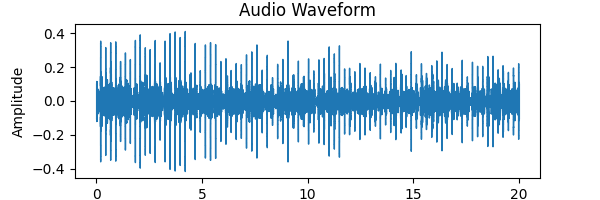
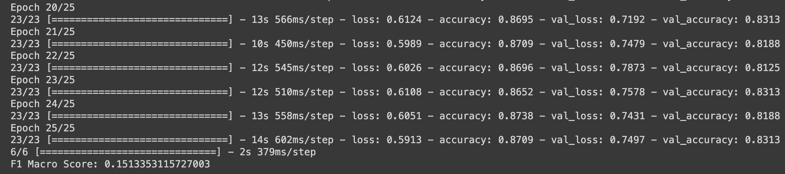
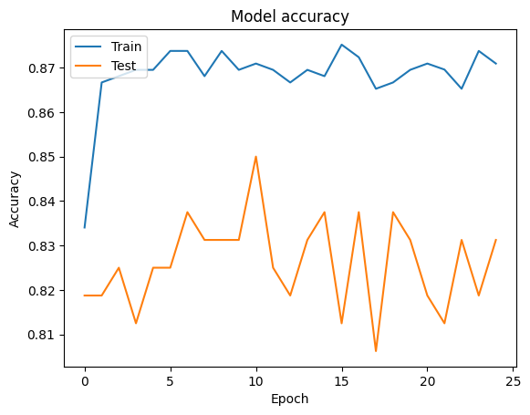
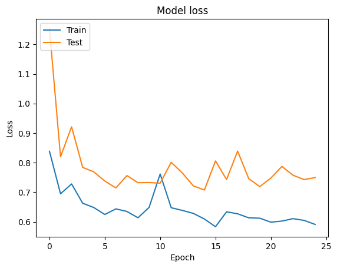
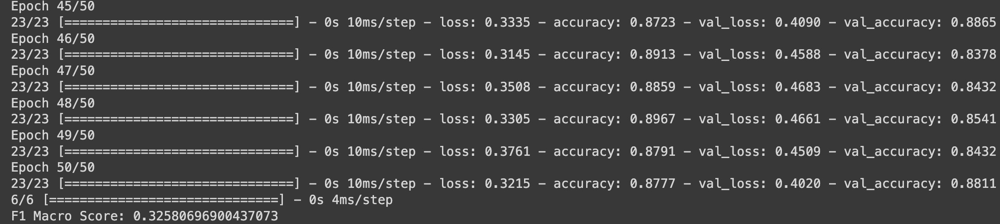
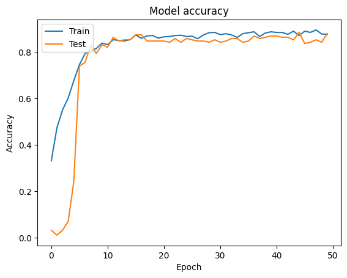
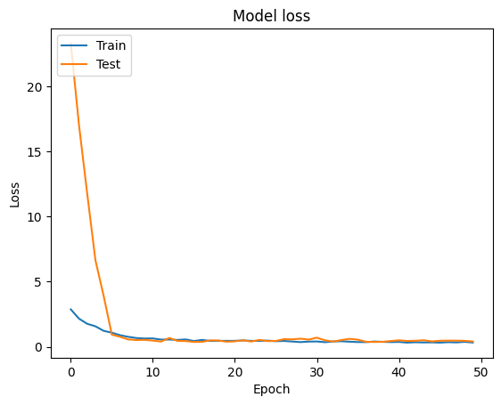
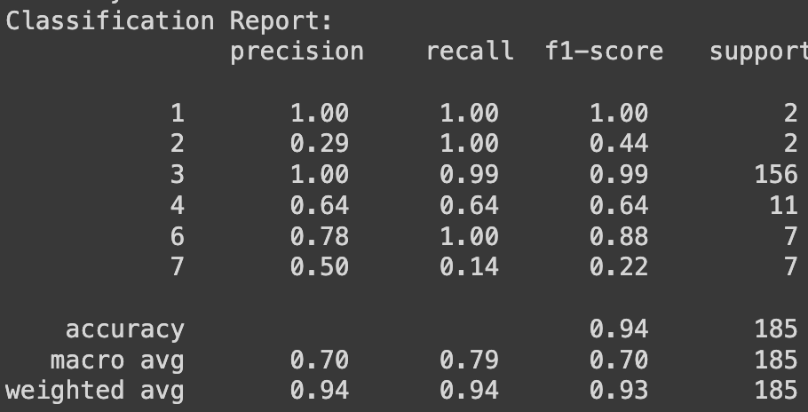
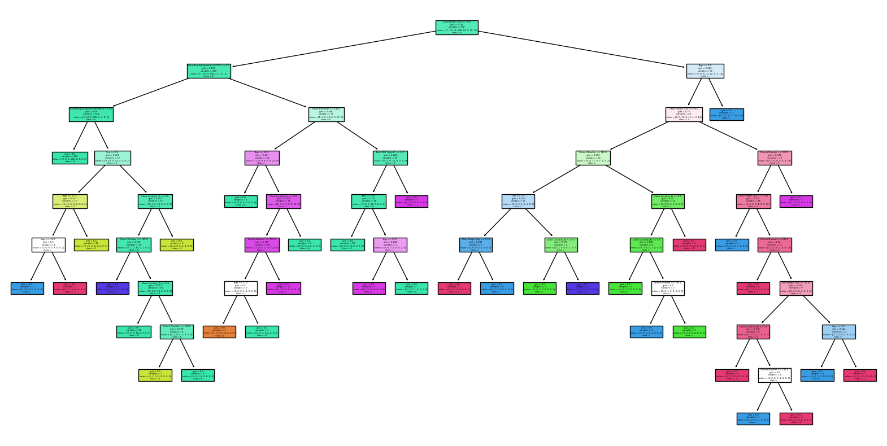

# Machine Learning for Lung Sound Analysis: Enhancing Respiratory Condition Diagnosis
 
CS 4641 Group 112 – Final Report  
Sandra Kurian, Rose Rosado, Arghya Roy, Rishab Verma, Arkin Worlikar

[Final Presentation Video](https://gtvault.sharepoint.com/:v:/s/CS115/EQn6rq8VkkZDpuq9IlyewtMBPffXKvj0-4CEPNAr7u61BQ?e=oLh47J)

## Introduction
Respiratory complications, a major global health concern, were a leading cause of mortality in 2019 according to the World Health Organization (WHO). Lung conditions exhibit unique sounds during respiration, necessitating precise diagnostics. This study advocates for machine learning analysis of lung sounds, framing it as a classification problem. Leveraging identified markers, we aim to categorize wheezes and crackles, among other lung sound signatures, to diagnose specific respiratory conditions. This approach holds promise in providing efficient, accessible, and accurate diagnoses, addressing healthcare disparities and improving patient outcomes.

## Problem Definition
Currently, the process of identifying lung conditions is conducted in-person through meetings with a healthcare professional. A machine learning model trained to recognize auditory indicators of a variety of lung conditions would be ideal for accelerating the process of diagnosing patients at a higher level of accuracy. This algorithm could be utilized in an automated machine, similar to current automatic blood pressure monitors. Users who have limited access to doctors could capture breathing audio at home and submit it online, receiving a diagnosis where otherwise impossible. Both of these applications reduce office wait time, allowing doctors to see more patients and allowing patients to receive feedback faster. Therefore, developing a model such as this promises to be very beneficial in helping both patients and professionals in the healthcare industry.

## Data Collection
The databased utilized for the study, The Respiratory Sound Data, was created by teams of researchers in Greece and Portugal, with the goal of application in machine learning diagnosis studies. The dataset, published on Kaggle, contains 920 recordings of lung audio from 126 different patients, and the data set is packaged with demographic information for the respective patients [5]. The labels also include information regarding the specific sound features present and the corresponding lung conditions, which enables the implementation of supervised learning techniques. The researchers ensured comprehensive data by collecting waveform data from different chest locations such as anterior and posterior of the body, as well as at the trachea and lateral sides. The audio was collected using 1 microphone and 3 different stethoscopes, and these are also labeled in the data.

### Data Preprocessing
The Kaggle data set includes sound files and text files that contain information about naming conventions and the attributes of the data. The preprocessing step first involved parsing filenames to classify the data by patient number, recording index for the patient, acquisition channels used, and recording equipment used. The information was all converted into pandas data frames for accessibility. Because the model is a CNN which takes in inputs as an image, as part of the preproccessing the audio waveforms were converted into images for use in CNNs with the librosa Python package. There were no significant holes in the data, but for patient demographics and info that was not provided, the field in the data frame was simply left as “None” and ignored. 

<figure style="text-align:center;">
    
    <figcaption><em>Example of a Waveform Image Using Librosa: Because of the nature of audio data, it is not possible to create an informative visualization of the entire dataset</em></figcaption>
</figure>

## Methods
The methods for our supervised model are Convolutional Neural Networks (CNNs), Recurrent Neural Networks (RNNs), and Decision Tree Classifiers (DTC). CNNs are a popular approach to audio problems and have shown high accuracy results for analyzing lung audio. CNNs are particularly good for audio because they are “translation invariant,” due to their use of a convolutional layer, so a defining characteristic in the data will contribute the same to the output, regardless of when it occurs [4]. RNNs are better at picking up long-term dependencies so depending on the shape of the audio, it might perform better. Decision Tree is a supervised machine learning model used for both classification and regression tasks. It recursively splits the dataset into subsets based on the most significant attribute at each node, forming a tree-like structure. Each internal node represents a decision based on a feature, each branch represents the outcome of that decision, and each leaf node represents the final predicted class or value. The decision-making process follows a set of rules determined during the model training phase, where the algorithm learns to make optimal splits based on the input features.

### CNN
The first method implemented was a Convolutional Neural Network (CNN). The inputs to the neural network are waveforms produced in our preprocessing step. The CNN is set up with three convolutional layers and two dense layers. The input data was split into training and testing data, with 80% of the data going into the training data and 20% into testing. The network was trained for 25 epochs.

<!-- ## Results and Discussion -->
<!-- Ultimately, our model will help determine any respiratory disorders the patient may have. As our largest dataset contains eight labels with significantly different values, we are dealing with a multi-class classification problem with imbalanced classes. To avoid having a model just return COPD, Healthy, and URTI as diagnoses, which would yield an accuracy of >80%, we need to use an F-1 score. Since we are developing a healthcare application, we can’t afford to miss a condition, even if it is rare, so we prefer the macro F-1 score. This score will determine how well the model performs across all classes, even minority ones. -->

The model achieved an accuracy of 84.38% on the test data and 87.52% on the training data. Since the model performed similarly on the training data and the test data, the model is likely to not be overfitted. As we discussed in our project proposal, quite a high percent accuracy is required for our problem since the dataset is not uniformly distributed and we are particularly averse to false negatives, so an even higher accuracy would be better. 
                                                                                     
<figure style="text-align:center;">
    
    <figcaption><em>Training Results of CNN</em></figcaption>
</figure>

<figure style="text-align:center;">
    
    <figcaption><em>CNN Accuracy Plot</em></figcaption>
</figure>

<figure style="text-align:center;">
    
    <figcaption><em>CNN Loss Plot</em></figcaption>
</figure>

### RNN
The second method implemented was a Recurrent Neural Network (RNN). The inputs to the neural network, much like the CNN, were produced in our preprocessing step. The RNN is set up with five batch normalization layers and six dense layers. The input data was split into training and testing data, with 80% of the data going into the training data and 20% into testing. The network was trained for 50 epochs.

The model achieved an accuracy of 88.11% on the test data and 87.77% on the training data. Again, these performances are very similar and don't indicate overfitting. The performance of the model was good, but our task would definitely benefit from a higher accuracy. This can be explored via implementation of Decision Trees in the following section. 

<figure style="text-align:center;">
    
    <figcaption><em>Training Results of RNN</em></figcaption>
</figure>

<figure style="text-align:center;">
    
    <figcaption><em>RNN Accuracy Plot</em></figcaption>
</figure>

<figure style="text-align:center;">
    
    <figcaption><em>RNN Loss Plot</em></figcaption>
</figure>

### Decision Tree Classifier

We decided to also consider the metadata of the audio files using a decision tree classifier. The model converted categorical variables to numerical representations and used one-hot encoding for categorical variables with more than two categories. With this, the model achieved an accuracy of 93.51% on the test data and 94% on the training data. The higher accuracy might be because of the accurate analysis on the presence of wheezes and crackles.

<figure style="text-align:center;">
    
    <figcaption><em>Training Results of Decision Tree Classifier</em></figcaption>
</figure>

<figure style="text-align:center;">
    
    <figcaption><em>Visualize the Decision Tree</em></figcaption>
</figure>

<!-- ### Future Improvements
There are multiple ways we can achieve this. On the preprocessing side, we can use signal processing techniques like a Short-Term Fourier transform, so that the inputs will better represent the frequencies present in the audio data. On the model side, we experiment with the hyperparameters to create a better model.  -->

### Conclusion

The difference in accuracy between a Decision Tree model using metadata and a Convolutional Neural Network (CNN) or Recurrent Neural Network (RNN) analyzing raw audio files can be attributed to the nature of the features used and the complexity of the modeling approach.

The Decision Tree model is trained on provided metadata features of the audio files. Metadata features might capture certain patterns or characteristics of the data, but they may not capture the intricate details present in raw audio waveforms. Still, for the data that was utilized within the model, it exhibited good performance.

CNNs and RNNs are powerful models for processing sequential data like audio waveforms. These neural networks can learn hierarchical representations and capture complex patterns directly from the raw audio signals, potentially leading to better performance when compared to models relying on metadata alone.

If the CNN and RNN models are trained properly with suitable architectures and hyperparameters, they have the potential to outperform simpler models like Decision Trees, especially when dealing with audio data. The choice between using metadata or raw audio data often depends on the specific characteristics of the task and the available data. For tasks involving audio analysis, models that directly process the raw audio signals often have an advantage in capturing nuanced patterns and nuances present in the audio data. The implementations we tested with our data performed well, but there is potential for improvement if the audio analysis was more robust. Further development could create stronger tools with more reliable outcomes.

## Contribution
[Gantt Chart](https://gtvault.sharepoint.com/:x:/s/CS115/EaxQjtWd-Y9Do3rxlIZu78IB9QNgB3hu7j-bnLRkNO6HnA?e=mar9bS)

| Name | Contribution |
|----------|----------|
| Sandra Kurian | proposed topics, setup initial documents and communication, drafted introduction, made proposal presentation, worked on Gantt Chart, data pre-processing, Decision Tree Classifier, final presentation slides, final report |
| Rose Rosado | proposed topics, drafted problem statement, GitHub pages setup, worked on video recording, data pre-processing, midterm report, final report, final presentation video |
| Arghya Roy | proposed topics, drafted potential results, organized Teams workflow, performed initial dataset analysis for evaluation criterion, worked on video slide and recording, CNN and RNN model |
| Rishab Verma | proposed topics, found datasets, research, drafted outline, revised proposal, worked on video recording, worked on Gantt Chart, midterm report, final presentation slides, final report |
| Arkin Worlikar | proposed topics, researched methods, drafted methods section, worked on video recording, edited video, CNN and CoLA model |

## References
1. A. Pandey and D. Wang, "TCNN: Temporal Convolutional Neural Network for Real-time Speech Enhancement in the Time Domain," ICASSP 2019 - 2019 IEEE International Conference on Acoustics, Speech and Signal Processing (ICASSP), Brighton, UK, 2019, pp. 6875-6879, doi: 10.1109/ICASSP.2019.8683634. 

2. A. Saeed, D. Grangier and N. Zeghidour, "Contrastive Learning of General-Purpose Audio Representations," ICASSP 2021 - 2021 IEEE International Conference on Acoustics, Speech and Signal Processing (ICASSP), Toronto, ON, Canada, 2021, pp. 3875-3879, doi: 10.1109/ICASSP39728.2021.9413528. 

3. G. Chambres, P. Hanna and M. Desainte-Catherine, "Automatic Detection of Patient with Respiratory Diseases Using Lung Sound Analysis," 2018 International Conference on Content-Based Multimedia Indexing (CBMI), La Rochelle, France, 2018, pp. 1-6, doi: 10.1109/CBMI.2018.8516489. 

4. Xia T, Han J, Mascolo C. Exploring machine learning for audio-based respiratory condition screening: A concise review of databases, methods, and open issues. Exp Biol Med (Maywood). 2022 Nov;247(22):2053-2061. doi: 10.1177/15353702221115428. Epub 2022 Aug 16. PMID: 35974706; PMCID: PMC9791302. 

5. Vbookshelf. (2019, January 29). Respiratory sound database. Kaggle. https://www.kaggle.com/datasets/vbookshelf/respiratory-sound-database
